# ZAP-Hosting In-Game Server Integration Mod

## 2. Visual Walkthrough & Core Features

###  1. In-Game First-Time Welcome Popup
When players boot a modpack or join a server for the first time, a polished welcome dialog appears with instant partner branding, one-click voucher copying, direct access to the in-game configurator, and a "Don't show this again" option.

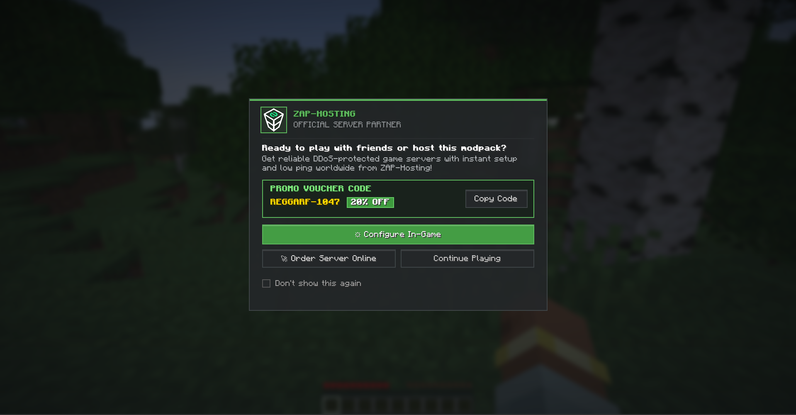

---

###  2. Multiplayer Menu Banner Integration
A clean, non-intrusive banner entry integrated directly into Minecraft's multiplayer server selection screen, inviting players who need a server to launch the wizard with a single click.

---

###  3. 10-Step Native In-Game Server Configurator

#### Step 1: Platform & Launcher Selection
Select between popular launcher formats including CurseForge/Twitch, FTB, Vanilla Minecraft, ATLauncher, Technic, VPS, and Dedicated Servers with live starting prices.
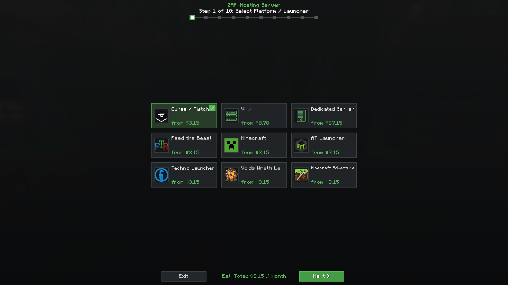

#### Step 2: Preinstalled Game & Modpack
Search and filter through live-indexed modpacks and Minecraft versions.
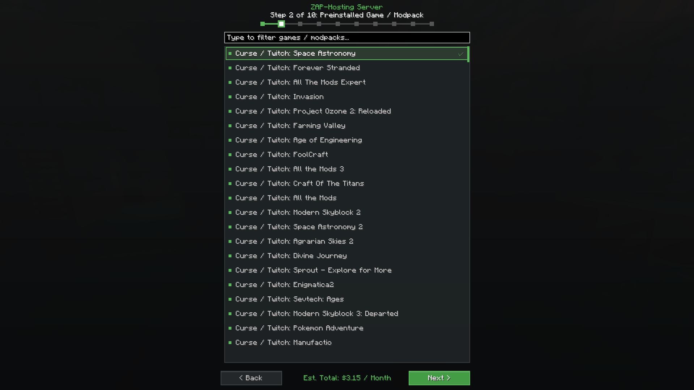

#### Step 3: Location Selection with Real-Time Ping Checker
Conducts real-time ICMP/TCP ping checks against actual ZAP-Hosting data centers worldwide (Frankfurt, London, Los Angeles, Ashburn, Montreal, Dallas, Sydney, Singapore) showing latency in milliseconds and protection backbones (PletX vs. OVH).
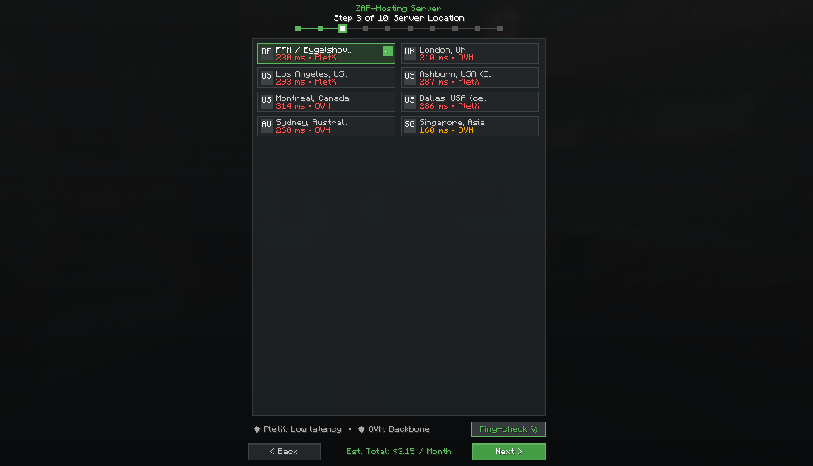

#### Step 4: Game Server Slots
Intuitive slider allowing players to select their desired player slots with bundled RAM capacity clearly noted.
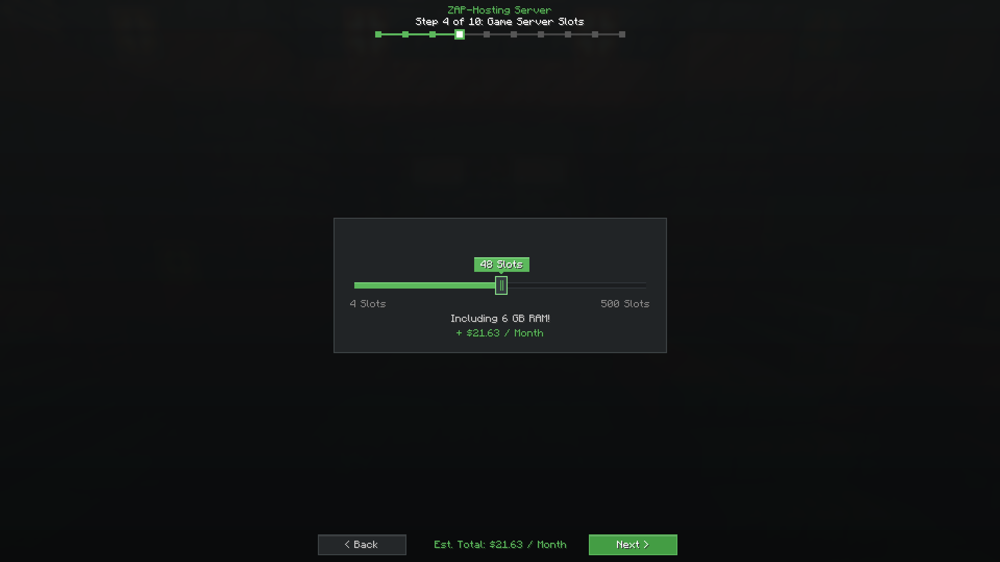

#### Step 5: RAM Boost
Dynamic memory upgrade slider showing base RAM + boost RAM calculations in real time.
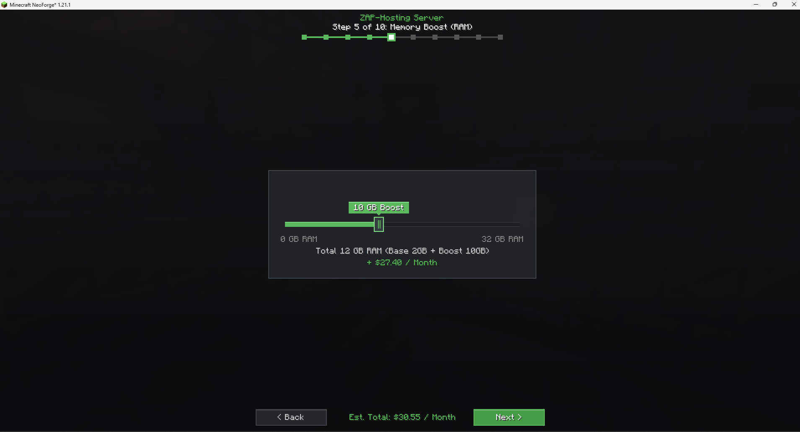

#### Step 6: Additional NVMe Disk Space
Slider for high-speed NVMe SSD storage adjustments.
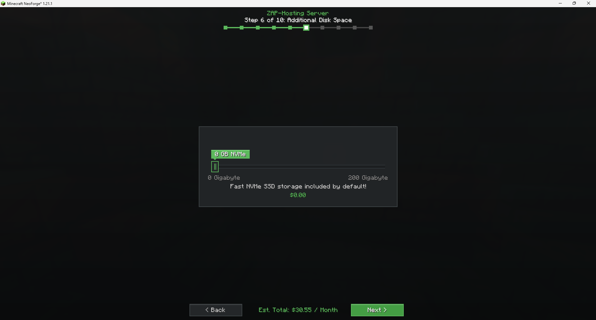

#### Step 7: CPU & Host Server Tier
Selection between Standard SSD and Premium Gaming CPU (M.2 SSD, 3.4–4.4 GHz) with clear performance recommendations.
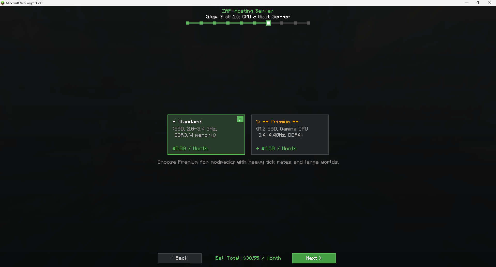

#### Step 8: Dedicated IPv4 Address
Option to toggle a dedicated IP address (standard `:25565` port) for custom domains.
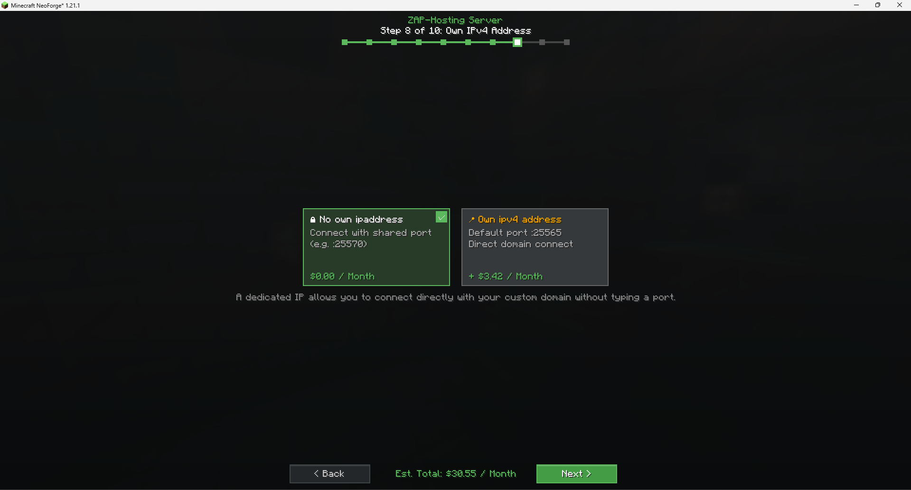

#### Step 9: DDoS Manager Overview
Option to activate live DDoS attack logs and dashboard graph analytics.
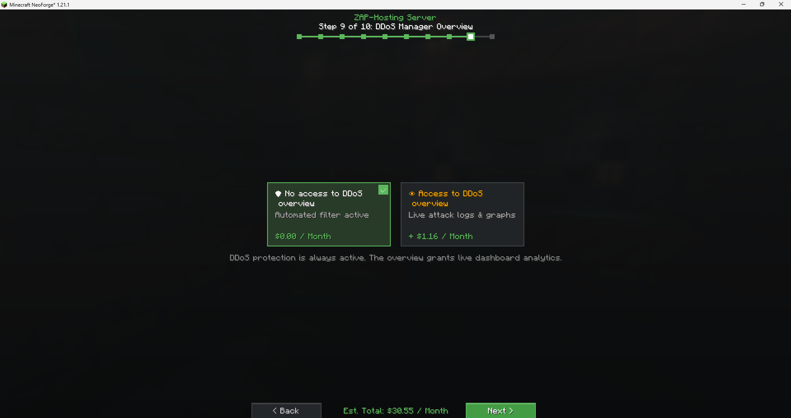

#### Step 10: Billing Interval, Pre-Payment Discounts & Checkout
Comprehensive cost summary displaying billing cycle, monthly breakdown, discount tiers, and partner voucher code application before checkout.
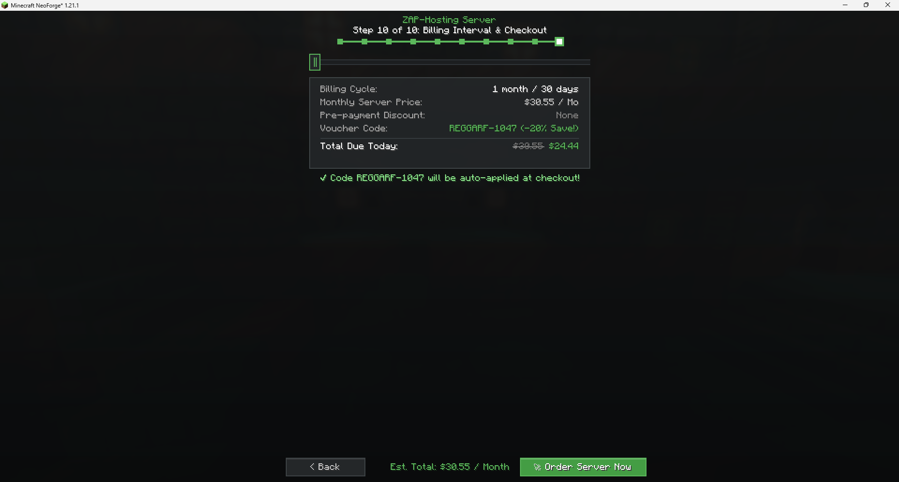

---

### 🛒 4. Automated Web Cart Transfer
Upon clicking **"Order Server Now"**, the mod opens the browser directly to ZAP-Hosting's official order page with **all configuration options pre-selected** and the **partner voucher code automatically applied**.

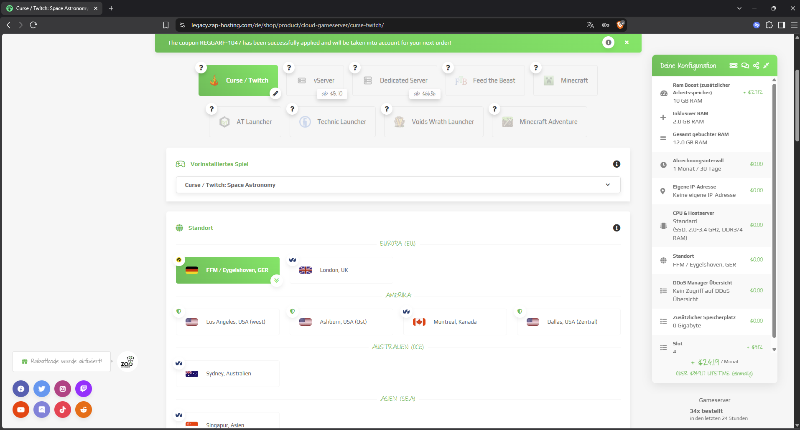

---

### ⚙️ 5. In-Game Configuration GUI (Creator & Partner Friendly)

The mod includes an in-game graphical settings screen accessible via the Mod Menu or NeoForge config list, allowing server owners and modpack authors to customize tracking and branding without manual JSON editing:

#### Tab 1: Affiliate & Promo Settings
Modpack developers and partners can effortlessly customize their promotion without recompiling:
- **In-Game Welcome Popup:** Toggle on/off or click **"Preview"** to test the popup anytime.
- **Partner Campaign Link:** URL target pinged to credit partner referral campaigns.
- **Partner ID (Affiliate Ref):** Automatically appends the creator's affiliate parameter (`?ref=...`) to all cart links.
- **Promo Voucher Code:** The custom discount coupon automatically applied at checkout (e.g. `REGGARF-1047`).
- **Voucher Discount %:** Interactive slider configuring the displayed promotional discount percentage.

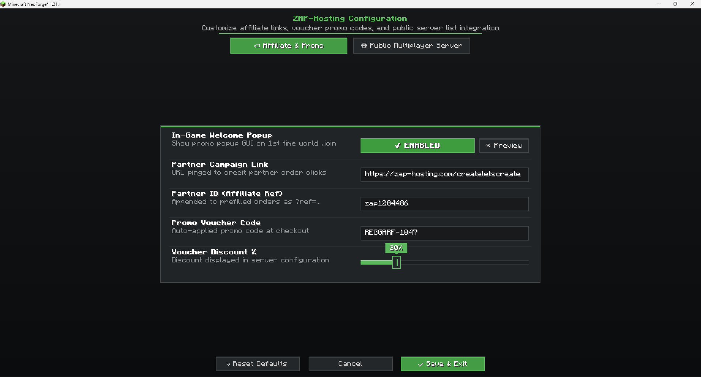

#### Tab 2: Public Multiplayer Server Integration
Modpack developers or network operators can feature an official multiplayer server directly in the Minecraft server list:
- **Enable Public Server:** Pin a permanent public/community server entry at the top of the multiplayer screen.
- **Server Display Name:** Custom title of the pinned entry (e.g. `"ZAP-Hosting Official Server"`).
- **Server IP / Domain:** The target Minecraft server host address (e.g. `play.zap-hosting.com`).
- **Server MOTD / Description:** Subtitle shown directly below the server title.
- **Custom Connect Screen:** Enables a branded, themed ZAP-Hosting loading/connecting screen while joining.

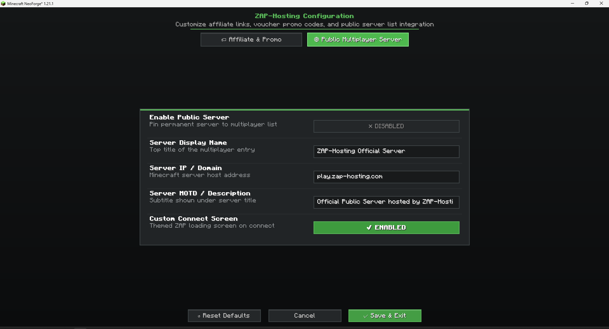

---
